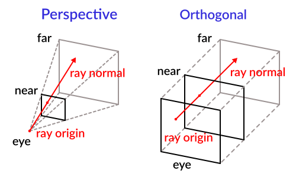

- https://test.domojyun.net/MEMO/3D/conclusion.html)

## 介绍

Three.js 是一个非常方便的 JavaScript 函数库，用于开发 WebGL，它将大量功能封装成物体导向的方法和属性，可以非常方便的使用物体导向的开发模式绘制 3D 空间。

官网：https://threejs.org/
GitHub：https://github.com/mrdoob/three.js/
以下范例皆用 three.js v89 版本进行实作，目前已将原书语法更进为最新版本的语法喽！

范例：[2*ThreeJS / 01*绘制基本流程/ 01_3D 贴图的立方体](http://test.domojyun.net/EX/3D/2_ThreeJS/01_渲染基本流程/01_3D貼圖的立方體.html)
感觉一下基本 Three.js 的写法～
可以看到，不需写着色器就可以顺利绘制一个模型，大大减少开发所需的工作量！

## _1_.绘制基本流程

依据上述范例，Three.js 使用场景放置物体，把物体增加到场景之后，需要为场景提供一个相机（观察点），然后使用渲染器绘制，基本流程为：

1. **建立场景**
2. **建立相机**
3. **建立模型、材质并放置到场景**
4. **建立渲染器**
5. **重新绘制**

### **使用渲染器**

Three.js 提供两种渲染器：

- **WebGLRenderer 渲染器**
  使用 WebGLRenderingContext2D 实现 GPU 加速的 3D 和 2D 绘图。
- **CanvasRenderer 渲染器**
  使用 CanvasRenderingContext2D 实现 2D 绘图。

**在某些特定情况下，CanvasRenderer 渲染器也可以使用 2D 环境模拟出来 3D 效果**，但并非所有 3D 功能都能模拟，特别是有关材质和光源的情况下（常常同时又会有关着色器），是不能模拟的，因此 3D 处理还是建议使用 WebGLRender 渲染器。

如果浏览器不支持 WebGLRenderingContext，而要实现的 3D 影像刚好又不需要材质和光源，此时就可以使用 CanvasRenderer 渲染器：

```js
//如果支持 WebGLRenderingContext 就使用 WebGLRenderer 渲染器
if (window.WebGLRenderingContext) {
  renderer = new THREE.WebGLRenderer();
} else {
  renderer = new THREE.CanvasRenderer();
}
```

### **使用场景**

场景可以放置模型、光源和相机，然后渲染器根据这些进行绘制，相机在建立后自动增加到场景中，但模型和光源必须使用 add() 方法增加：

```
//将曲面增加到场景中
scene.add(mesh)
//建立一个点光源增加到场景中
var light = new THREE.PointLight(0xff0000, 1, 100);
light.position.set(50, 50, 50);
scene.add(light);
```

任何物体再加入到场景中，都会加入到 Scene 的 children 属性中，可用来检查所有物体：

```
//检查场景中的所有物体
for(var i = 0, l = scene.children.length; i < l; i++)
}
```

### **使用相机**

相机就是观察点，有两种类型，都继承自 Camera 类别：

1. **透视投影相机（PerspectiveCamera）**
   `THREE.PerspectiveCamera(fov, aspect, ear, far);`
2. **正交投影相机（OrthographicCamera）**
   `THREE.OrthographicCamera(left, right, top, bottom, near, far);`



从构造方法来看，PerspectiveCamera 参数都可以省略，因都有预设值；OrthographicCamera 只有后两个参数可以省略。如果想要增加观察矩阵，可使用 Camera 继承的 lookAt() 方法：
`Camera.lookAt(vector)`

参数 vector 是一个 THREE.Vector3 类型，表示一个点（焦点的位置），它没有提供 eye 参数和 up 参数，可透过建立相机后设定属性 position 和 up 来实现，这两个属性的值也都是 THREE.Vector3 类型：

```
//建立相机
camera = new THREE.PerspectiveCamera(55, 640/480, 1, 10000);
camera.position.z = 1000
//改变相机的朝向，这里把相机倒过来
camera.up.y = -1
//看向右上方
camera.lookAt(new THREE.Vector3(320, 240, 0));
```

### **绘制为曲面线框**

只需改变材质就可以非常方便绘制一个曲面线框：

```
//使用颜色建立一个材质
material = new THREE.MeshBasicMaterial({color: 0xff0000, wireframe: true});
//color 指定曲线框的颜色
//wireframe 设为 true 指定渲染为线框
```

可以在 3D 空间中增加两个模型，分别绘制两种材质，就能同时呈现绘制的效果和检视模型的组成。

范例：[2*ThreeJS / 01*绘制基本流程/ 02_3D 线框的立方体](http://test.domojyun.net/EX/3D/2_ThreeJS/01_渲染基本流程/02_3D線框的立方體.html)

## *2.*曲面建构–几何形体

曲面就是 3D 空间中的物体，包含模型以及其上的材质，Three.js 是用 Mesh 类别来表示这个物体，Mesh 类别只有两个属性，表示几何形体的 geometry 物体和材质 material 物体，Mesh 物体的这两个属性相互紧密连结：

```
THREE.Mesh = function(geometry, material){
//...
}
```

geometry 中 vertices 属性决定顶点的清单，faces 属性决定面的组成，faceVertexUv 属性决定纹理座标，faces 属性是一组 face 物体，每个 face 物体的 materialIndex 属性用比对 material 物体。

### **Object3D 和基本类型**

Three.js 中 3D 物体都继承于 Object3D，包含相机、几何模型等，他定义了一些基本属性和方法可被其他物体继承：

```
//最常用的三個属性
Object3D.position //坐标，包含 x、y、z 属性
Object3D.rotation //旋转，包含 x、y、z 属性
Object3D.scale   //缩放，包含 x、y、z 属性
//表示向量和坐标，下面定义一个法向量
var normal = new THREE.Vector3(0, 1, 0)
//表示颜色
var color = new THREE.Color(0xff0000);
var color = new THREE.Color("rgb(255,0,0)")
var color = new THREE.Color();
color.r = 1.0;         //r、g、b 属性设置各分量，值都是 0~1 之间的数字
color.g = 0;
color.b = 0;
color.setSHL(h,s,l);  //使用 HSL 设置颜色
color.getHSL();     //使用 HSL 值，傳回值是一個包含 h、s、l 的 Object
```

表示一个三角形面，用顶点索引来建构三角形面：
`Face3(a, b, c, vertexNormals, vertexColors, materialIndex);`

- 前面参数就三角形顶点的索引
- vertexNormals 是这个面的法线（必须是三个顶点的法线组成的阵列，每个法线是一个 THREE.Vector3 类型）
- vertexColors 是这个面的颜色（必须是三个顶点的颜色组成的阵列，每个颜色是一个 THREE.Color 类型）
- materialIndex 是这个面的材质索引

```
var face = new THREE.Face3(0, 1, 2,
[new THREE.Vector3(0, 1, 0),
new THREE.Vector3(0, 1, 0),
new THREE.Vector3(0, 1, 0)],
[new THREE.Color(0xff0000),
new THREE.Color(0xff0000),
new THREE.Color(0xff0000)],
0);
```

范例：[2*ThreeJS / 02*曲面建构–几何形体/ 01_3D 颜色的立方体](http://test.domojyun.net/EX/3D/2_ThreeJS/02_曲面建構–幾何形體/01_3D颜色的立方體.html)

### **自定义几何模型**

使用 Geometry 类别表示几何模型，在几何模型上包含顶点座标、顶点索引阵列（也就是面的组成）、纹理座标。vertices 属性决定顶点的清单，faces 属性决定面的组成，faceVertexUv 属性决定纹理座标。

如果想使用顶点颜色作为纹理，就可以使用每个 face 的 VertexColors 属性，该属性是一个 THREE.Color 类型，指定面上每个顶点的颜色。

### **使用 BufferGeometry**

若想使用原生 API 的 GPU 快取方式来写代码，就可以使用 BufferGeometry，这个类别将顶点、索引、颜色或纹理座标、法线资料封装在一起，可以**充分利用 GPU 快取中，实现大幅的加速功能**。

但也是它的缺陷，因为快取计算比较复杂，因此如果更改这些快取中的资料就会花费更多计算，因此这类别**主要用在静态物体**。

范例：[2*ThreeJS / 02*曲面建构–几何形体/ 02\_使用 BufferGeometry](http://test.domojyun.net/EX/3D/2_ThreeJS/02_曲面建構–幾何形體/02_使用BufferGeometry.html)

### **资料更新**

虽然 JavaScript Object 类型是一种参考类型，但不表示更改了属性就一定会导致物体更新！

举例来说，一个 Geometry 物体的顶点属性 vertices 发生改变，并不会更新 Mesh，因为 Three.js 将 Mesh 的资讯快取为某种最佳化的结构，如果要让 Mesh 物体更新，必须通知 Three.js 重新计算快取中的结构：

```
1.``//设置 Geometry 為動態，這樣才允許改變其中的頂點
2.``geometry.dynamic = ``true``;
3.
4.``//告訴 Three.js 需要更新頂點
5.``geometry.verticesNeedUpdate = ``true``;
6.
7.``//告訴 Three.js 需要重新計算法線
8.``geometry.normalsNeedUpdate = ``true``;
```

原书作者认为 verticesNeedUpdate 和 normalsNeedUpdate 两个属性是最有用的，然后应该仅**仅标示那些确实需要计时计算的属性**，避免无谓的运算负担，其他可以使用的标示更新的属性：

| 属性                    | 功能                                                                                                                       |
| ----------------------- | -------------------------------------------------------------------------------------------------------------------------- |
| dynamic                 | 设定快取中的资料可以动态更新，该属性预设设定为 true，如果不设定为该属性为 true，Geometry 资料被上传给 GPU 快取后就会被删除 |
| verticesNeedUpdate      | 设定 true 表示需要更新顶点                                                                                                 |
| elementsNeedUpdate      | 设定 true 表示需要更新顶点索引                                                                                             |
| uvsNeedUpdate           | 设定 true 表示需要更新顶点纹理座标                                                                                         |
| normalsNeedUpdate       | 设定 true 表示需要更新顶点法线                                                                                             |
| tangentsNeedUpdate      | 设定 true 表示需要更新顶点切线                                                                                             |
| colorsNeedUpdate        | 设定 true 表示需要更新顶点颜色纹理                                                                                         |
| lineDistancesNeedUpdate | 设定 true 表示需要更新线之间的距离阵列                                                                                     |
| buffersNeedUpdate       | 设定 true 表示需要更新快取的长度，因为阵列长度改变了                                                                       |

### **内建几何模型**

Three.js 提供了基本的几何模型，这些几何模型已经计算了法线，甚至纹理座标都已经提供：

| 类别                                            | 功能                                                                                                                                                            |
| ----------------------------------------------- | --------------------------------------------------------------------------------------------------------------------------------------------------------------- |
| PlaneGeometry PlaneBufferGeometry               | 平面                                                                                                                                                            |
| ShapeGeometry ShapeBufferGeometry               | 单面多边形                                                                                                                                                      |
| CircleGeometry CircleBufferGeometry             | 圆或圆弧                                                                                                                                                        |
| RingGeometry RingBufferGeometry                 | 二维环状                                                                                                                                                        |
| BoxGeometry BoxBufferGeometry                   | 立方体                                                                                                                                                          |
| SphereGeometry SphereBufferGeometry             | 球体                                                                                                                                                            |
| ConeGeometry ConeBufferGeometry                 | 角锥体                                                                                                                                                          |
| CylinderGeometry CylinderBufferGeometry         | 圆柱体                                                                                                                                                          |
| TetrahedronGeometry TetrahedronBufferGeometry   | 正 4 面体                                                                                                                                                       |
| OctahedronGeometry OctahedronBufferGeometry     | 正 8 面体                                                                                                                                                       |
| DodecahedronGeometry DodecahedronBufferGeometry | 正 12 面体                                                                                                                                                      |
| IcosahedronGeometry IcosahedronBufferGeometry   | 正 20 面体                                                                                                                                                      |
| ExtrudeGeometry ExtrudeBufferGeometry           | 根据平面路径挤压出一个几何体                                                                                                                                    |
| LatheGeometry LatheBufferGeometry               | 切割机床方式根据一个平面削成几何体                                                                                                                              |
| ParametricGeometry ParametricBufferGeometry     | 参数化几何体                                                                                                                                                    |
| PolyhedronGeometry PolyhedronBufferGeometry     | 根据顶点建立几何形状，但比 Geometry 有些增强                                                                                                                    |
| TextGeometry TextBufferGeometry                 | 文字体 可使用[Helvetiker 字型](https://github.com/anvaka/three.regular.helvetiker)或使用其他英文字体（需[转换 json 格式](http://gero3.github.io/facetype.js/)） |
| TorusGeometry TorusBufferGeometry               | 环状曲面体                                                                                                                                                      |
| TorusKnotGeometry TorusKnotBufferGeometry       | 环状结体                                                                                                                                                        |
| TubeGeometry TubeBufferGeometry                 | 管状体                                                                                                                                                          |
| EdgesGeometry                                   | 边缘体                                                                                                                                                          |
| WireframeGeometry                               | 线框体                                                                                                                                                          |

范例：[2*ThreeJS / 02*内建几何模型/ 01*PlaneGeometry*平面](http://test.domojyun.net/EX/3D/2_ThreeJS/02_內建幾何模型/01_PlaneGeometry_平面.html)
范例：[2*ThreeJS / 02*内建几何模型/ 02*ShapeGeometry*单面多边形](http://test.domojyun.net/EX/3D/2_ThreeJS/02_內建幾何模型/02_ShapeGeometry_單面多邊形.html)
范例：[2*ThreeJS / 02*内建几何模型/ 03*CircleGeometry*圆或圆弧](http://test.domojyun.net/EX/3D/2_ThreeJS/02_內建幾何模型/03_CircleGeometry_圓或圓弧.html)
范例：[2*ThreeJS / 02*内建几何模型/ 04*RingGeometry*二维环状](http://test.domojyun.net/EX/3D/2_ThreeJS/02_內建幾何模型/04_RingGeometry_二維環狀.html)
范例：[2*ThreeJS / 02*内建几何模型/ 05*BoxGeometry*立方体](http://test.domojyun.net/EX/3D/2_ThreeJS/02_內建幾何模型/05_BoxGeometry_立方體.html)
范例：[2*ThreeJS / 02*内建几何模型/ 06*SphereGeometry*球体](http://test.domojyun.net/EX/3D/2_ThreeJS/02_內建幾何模型/06_SphereGeometry_球體.html)
范例：[2*ThreeJS / 02*内建几何模型/ 07*ConeGeometry*角锥体](http://test.domojyun.net/EX/3D/2_ThreeJS/02_內建幾何模型/07_ConeGeometry_角錐體.html)
范例：[2*ThreeJS / 02*内建几何模型/ 08*CylinderGeometry*圆柱体](http://test.domojyun.net/EX/3D/2_ThreeJS/02_內建幾何模型/08_CylinderGeometry_圓柱體.html)
范例：[2*ThreeJS / 02*内建几何模型/ 09*TetrahedronGeometry*正 4 面体](http://test.domojyun.net/EX/3D/2_ThreeJS/02_內建幾何模型/09_TetrahedronGeometry_正4面體.html)
范例：[2*ThreeJS / 02*内建几何模型/ 10*OctahedronGeometry*正 8 面体](http://test.domojyun.net/EX/3D/2_ThreeJS/02_內建幾何模型/10_OctahedronGeometry_正8面體.html)
范例：[2*ThreeJS / 02*内建几何模型/ 11*DodecahedronGeometry*正 12 面体](http://test.domojyun.net/EX/3D/2_ThreeJS/02_內建幾何模型/11_DodecahedronGeometry_正12面體.html)
范例：[2*ThreeJS / 02*内建几何模型/ 12*IcosahedronGeometry*正 20 面体](http://test.domojyun.net/EX/3D/2_ThreeJS/02_內建幾何模型/12_IcosahedronGeometry_正20面體.html)
范例：[2*ThreeJS / 02*内建几何模型/ 13*ExtrudeGeometry*挤出](http://test.domojyun.net/EX/3D/2_ThreeJS/02_內建幾何模型/13_ExtrudeGeometry_擠出.html)
范例：[2*ThreeJS / 02*内建几何模型/ 14*LatheGeometry*切削](http://test.domojyun.net/EX/3D/2_ThreeJS/02_內建幾何模型/14_LatheGeometry_切削.html)
范例：[2*ThreeJS / 02*内建几何模型/ 15*ParametricGeometry*参数化几何体](http://test.domojyun.net/EX/3D/2_ThreeJS/02_內建幾何模型/15_ParametricGeometry_參數化幾何體.html)
范例：[2*ThreeJS / 02*内建几何模型/ 16*PolyhedronGeometry*自订几何形状体](http://test.domojyun.net/EX/3D/2_ThreeJS/02_內建幾何模型/16_PolyhedronGeometry_自訂幾何形狀體.html)
范例：[2*ThreeJS / 02*内建几何模型/ 17*TextGeometry*文字形状几何体](http://test.domojyun.net/EX/3D/2_ThreeJS/02_內建幾何模型/17_TextGeometry_文字形狀幾何體.html)
范例：[2*ThreeJS / 02*内建几何模型/ 18*TorusGeometry*环状曲面体](http://test.domojyun.net/EX/3D/2_ThreeJS/02_內建幾何模型/18_TorusGeometry_環狀曲面體.html)
范例：[2*ThreeJS / 02*内建几何模型/ 19*TorusKnotGeometry*环状结体](http://test.domojyun.net/EX/3D/2_ThreeJS/02_內建幾何模型/19_TorusKnotGeometry_環狀結體.html)
范例：[2*ThreeJS / 02*内建几何模型/ 20*TubeGeometry*管状体](http://test.domojyun.net/EX/3D/2_ThreeJS/02_內建幾何模型/20_TubeGeometry_管狀體.html)
范例：[2*ThreeJS / 02*内建几何模型/ 21*EdgesGeometry*边缘体](http://test.domojyun.net/EX/3D/2_ThreeJS/02_內建幾何模型/21_EdgesGeometry_邊緣體.html)
范例：[2*ThreeJS / 02*内建几何模型/ 22*WireframeGeometry*线框体](http://test.domojyun.net/EX/3D/2_ThreeJS/02_內建幾何模型/22_WireframeGeometry_線框體.html)

## *3.*曲面建构–材质和纹理

Three.js 提供内建材质，就不需自己写着色器，若想亲自写，可使用 MeshShaderMaterial。

创建材质时，除了颜色还有其他参数可以指定，例如光滑度和环境贴图。每个材质的建构方法只有一个参数，该参数是一个 Object 类型，其属性指定了材质的特性，这些属性也对应材质对象的属性。

Material 是所有其他类型的材质对象的基础类别，该类别建构方法没有参数，但定义了很多属性，每个属性都有预设值，供子类别继承。

### **内建曲面材质**

| 类别                 | 功能                                                                           |
| -------------------- | ------------------------------------------------------------------------------ |
| Material             | 所有其他类型的材质对象的基础类别，是一种抽象类别，不能直接使用                 |
| LineBasicMaterial    | 绘制线段的基本材质                                                             |
| LineDashMaterial     | 线段绘制成虚线的材质                                                           |
| MeshBasicMaterial    | 基本曲面材质，是一种与光源无关的材质，在没有光源的情况下，材质依然能够显示出来 |
| MeshDepthMaterial    | 用来绘制深度，颜色会随深度变化而变化，通常应该同时随着时间改变透明度           |
| MeshFaceMaterial     | 为曲面的每个面单独指定材质，改用 Array 指定                                    |
| MeshLambertMaterial  | 兰伯特面材质                                                                   |
| MeshNormalMaterial   | 基本材质，基于法线为曲面绘制颜色，通常用来测试                                 |
| MeshPhongMaterial    | 冯氏反射面材质                                                                 |
| MeshStandardMaterial | 基本亮点反射面材质                                                             |
| MeshPhysicalMaterial | 物理光学亮点反射面材质                                                         |
| MeshToonMaterial     | 卡通感的反射面材质                                                             |
| PointsMaterial       | 粒子系统预设使用的材质                                                         |
| ShaderMaterial       | 可以自己写着色器实现光源和反射                                                 |
| RawShaderMaterial    | 类似 ShaderMaterial                                                            |
| ShadowMaterial       | 可以接收影子的材质，否则他会完全透明                                           |
| SpriteMaterial       | 为 Sprite 提供材质                                                             |

范例：[2*ThreeJS / 03*内建曲面材质/ 01_MeshBasicMaterial](http://test.domojyun.net/EX/3D/2_ThreeJS/03_內建曲面材質/01_MeshBasicMaterial.html)
范例：[2*ThreeJS / 03*内建曲面材质/ 02_MeshDepthMaterial](http://test.domojyun.net/EX/3D/2_ThreeJS/03_內建曲面材質/02_MeshDepthMaterial.html)
范例：[2*ThreeJS / 03*内建曲面材质/ 03_MeshFaceMaterial](http://test.domojyun.net/EX/3D/2_ThreeJS/03_內建曲面材質/03_MeshFaceMaterial.html)
范例：[2*ThreeJS / 03*内建曲面材质/ 04_MeshLambertMaterial](http://test.domojyun.net/EX/3D/2_ThreeJS/03_內建曲面材質/04_MeshLambertMaterial.html)
范例：[2*ThreeJS / 03*内建曲面材质/ 05_MeshNormalMaterial](http://test.domojyun.net/EX/3D/2_ThreeJS/03_內建曲面材質/05_MeshNormalMaterial.html)
范例：[2*ThreeJS / 03*内建曲面材质/ 06_MeshPhongMaterial](http://test.domojyun.net/EX/3D/2_ThreeJS/03_內建曲面材質/06_MeshPhongMaterial.html)
范例：[2*ThreeJS / 03*内建曲面材质/ 07_MeshStandardMaterial](http://test.domojyun.net/EX/3D/2_ThreeJS/03_內建曲面材質/07_MeshStandardMaterial.html)
范例：[2*ThreeJS / 03*内建曲面材质/ 08_MeshPhysicalMaterial](http://test.domojyun.net/EX/3D/2_ThreeJS/03_內建曲面材質/08_MeshPhysicalMaterial.html)
范例：[2*ThreeJS / 03*内建曲面材质/ 09_MeshToonMaterial](http://test.domojyun.net/EX/3D/2_ThreeJS/03_內建曲面材質/09_MeshToonMaterial.html)
范例：[2*ThreeJS / 03*内建曲面材质/ 10_ShaderMaterial](http://test.domojyun.net/EX/3D/2_ThreeJS/03_內建曲面材質/10_ShaderMaterial.html)
范例：[2*ThreeJS / 03*内建曲面材质/ 11_RawShaderMaterial](http://test.domojyun.net/EX/3D/2_ThreeJS/03_內建曲面材質/11_RawShaderMaterial.html)

### **曲面材质**

曲面材质决定应用于曲面的纹理和光源特性，以 MeshBasicMaterial 为例，其中包含以下属性：

| 类别               | 功能                                                                                                                                                            |
| ------------------ | --------------------------------------------------------------------------------------------------------------------------------------------------------------- |
| color              | 十六进位整数，如果设定了 color 属性，整个材质将全部使用这个种颜色，预设值为 0xffffff，如果指定使用顶点颜色（VertexColor 属性设定为 true），那么设定将不会有作用 |
| map                | 指定纹理物体，也就是一个 THREE.Texture 物体，预设值为 null                                                                                                      |
| wireframe          | 如果设定为 true，那么整个几何形状就显示为线框（即只显示边，不显示面），预设值为 false                                                                           |
| wireframeLinewidth | 当显示为线框时线条的粗细，预设值为 1                                                                                                                            |
| wireframeLinecap   | 当显示为线框时线条端点的形状，也就是线盖，合法值为 butt、round、square，预设值为 round                                                                          |
| wireframeLinejoin  | 指定两个线条如何结合，合法的值是 round、bevel、miter，分别表示尖角、圆角或斜角，预设值为 round                                                                  |
| shading            | 定义著色类型，预设值为 THREE.SmoothShading                                                                                                                      |
| vertexColors       | 定义是否使用顶点颜色，预设值为 false（常数 THREE.NoColors）                                                                                                     |
| fog                | 定义该材质的颜色是否会被全域的 fog 设定影响，预设值为 true                                                                                                      |
| lightMap           | 定义光源影射，预设值为 null                                                                                                                                     |
| specularMap        | 定义镜面影射，预设值为 null                                                                                                                                     |
| envMap             | 定义环境影射，预设值为 null                                                                                                                                     |
| skinning           | 预设值为 false                                                                                                                                                  |
| morphTargets       | 定义是否使用顶点变形动画，预设值为 false                                                                                                                        |

### **建构纹理及天空盒**

立方图纹理经常被用来建构天空盒，Three.js 预建了能够使用立方图纹理的著色器。

天空盒又有两种做法，一种是球型贴图、另一种是方块体贴图：
范例：[2*ThreeJS / 03*曲面建构–材质和纹理/ 01\_建构天空盒\_box](http://test.domojyun.net/EX/3D/2_ThreeJS/03_曲面建構–材質和紋理/01_建構天空盒_box.html)
范例：[2*ThreeJS / 03*曲面建构–材质和纹理/ 02\_建构天空盒\_sphere](http://test.domojyun.net/EX/3D/2_ThreeJS/03_曲面建構–材質和紋理/02_建構天空盒_sphere.html)

### **建构线段**

有两种类型的线段材质，分别表示实现和虚线：

- **LineBasicMaterial**
  最基本的用于绘制线段的材质
- **LineDashedMaterial**
  是一种虚线类型的线段材质

范例：[2*ThreeJS / 03*曲面建构–材质和纹理/ 03\_建构线段](http://test.domojyun.net/EX/3D/2_ThreeJS/03_曲面建構–材質和紋理/03_建構線段.html)

### **粒子系统**

粒子就是绘制一个一个的点，然后在着色器中使用内建变数 gl_PointSize 改变点的大小，成为一个方块，然后赋以纹理。当多个粒子组合起来就形成一个粒子系统，粒子系统被视为一个整体的物体，我们仍然可以为每个粒子单独着色，因为在绘制的过程中，Three.js 透过 attribute 参数 color 向着色器传递了每一个顶点的颜色。

在粒子系统第一次被绘制时，Three.js 会将其资料快取下来，之后无法增加或减少系统中的粒子，如果不希望看到某个粒子，可将它的**颜色中的 alpha 值设定为 0，但无法删除它**，所以在建立粒子系统时，就将所有可能需要显示的粒子考虑进来。

范例：[2*ThreeJS / 03*曲面建构–材质和纹理/ 04\_粒子系统](http://test.domojyun.net/EX/3D/2_ThreeJS/03_曲面建構–材質和紋理/04_粒子系統.html)

### **Sprite 和 SpriteMaterial**

Sprite 是一个 2D 的几何像素，主要用于 CanvasRenderer 渲染器，但 WebGLRenderer 渲染器也可绘制，此时 Sprite 被绘制成一个矩形，SpriteMaterial 专门为 Sprite 提供材质。

不同于 Partical 在顶点着色器中改变大小，Sprite 继承自 Object3D，**透过 scale 来改变矩形大小**，预设为 1x1。

范例：[2*ThreeJS / 03*曲面建构–材质和纹理/ 05_Sprite 和 SpriteMaterial](http://test.domojyun.net/EX/3D/2_ThreeJS/03_曲面建構–材質和紋理/05_Sprite和SpriteMaterial.html)

## *4*光源

光源模型，从光源本身角度来看包含环境光、平行光、点光源，从物体比面材质角度看又包含漫反射和镜面反射，**光源应配合 MeshLambertMaterial 和 MeshPhongMaterial 使用**。

Three.js 提供了常见的几种光源，因此无需写着色器就可直接使用这些光源类型为模型打光，内建光源类型：

| 类别             | 功能                                                                                                                                                                                      |
| ---------------- | ----------------------------------------------------------------------------------------------------------------------------------------------------------------------------------------- |
| Light            | 所有其他类型的光的基础类别，这是一个抽象类别，不能直接使用                                                                                                                                |
| AmbientLight     | 环境光，没有方向                                                                                                                                                                          |
| RectAreaLight    | 区域光，是二维矩形光源，俗称面灯，有些被实现为椭圆形区域、大部分为一个矩形区域，仅能用 WebGLDederredRender 渲染器，即延迟渲染器，所谓延迟渲染器就是将场景先绘制为材质，再将材质指定给模型 |
| DirectionalLight | 平行光，仅能用于 MeshLambertMaterial 和 MeshPhongMaterial 材质，预设在点(0,1,1)，和相机预设方向一致                                                                                       |
| HemisphereLight  | 天顶光，又称天光，一种模拟日光的模型，太阳会发射平行光线，地面会反射平行光线，进一步组成日光                                                                                              |
| PointLight       | 点光源，仅能用于 MeshLambertMaterial 和 MeshPhongMaterial 材质，预设为原点                                                                                                                |
| SpotLight        | 聚光灯，仅能用于 MeshLambertMaterial 和 MeshPhongMaterial 材质                                                                                                                            |

*＊如果场景没有光，Three.js 预设会使用满环境光，物体会呈现其表面的颜色。*范例：[2*ThreeJS / 04*光源/ 01*AbientLight*环境光](http://test.domojyun.net/EX/3D/2_ThreeJS/04_光源/01_AbientLight_環境光.html)
范例：[2*ThreeJS / 04*光源/ 02*RectAreaLightHelper*区域光](http://test.domojyun.net/EX/3D/2_ThreeJS/04_光源/02_RectAreaLightHelper_區域光.html)
范例：[2*ThreeJS / 04*光源/ 03*DirectionalLight*平行光](http://test.domojyun.net/EX/3D/2_ThreeJS/04_光源/03_DirectionalLight_平行光.html)
范例：[2*ThreeJS / 04*光源/ 04*HemisphereLight*天顶光](http://test.domojyun.net/EX/3D/2_ThreeJS/04_光源/04_HemisphereLight_天頂光.html)
范例：[2*ThreeJS / 04*光源/ 05*PointLight*点光源](http://test.domojyun.net/EX/3D/2_ThreeJS/04_光源/05_PointLight_點光源.html)
范例：[2*ThreeJS / 04*光源/ 06*SpotLight*聚光灯](http://test.domojyun.net/EX/3D/2_ThreeJS/04_光源/06_SpotLight_聚光燈.html)

## *5*阴影

要产生阴影有四个步骤：

1. **渲染器设定**
   阴影需要大量运算，预设为不启用阴影功能，所以首先渲染器必须启用阴影功能。
   `renderer.shadowMapEnable = true;`
2. **光源设定**
   只有平行光和聚光灯才可以产生阴影，如果想让某个光源可以产生阴影，必须设定该光源产生阴影。
   `light.castShadow = true;`
3. **物体产生阴影设定**
   只有物体挡着光才会产生阴影，如果想让某个物体可以挡着光产生阴影。
   `mesh1.castShadow = true;`
4. **物体接收阴影设定**
   如果想让某个物体表面产生阴影，必须设定物体接收阴影。
   `mesh2.receiveShadow = true;`

### **渲染器设定属性**

| 属性                 | 功能                                                                                                                                                                                                                                                                                     |
| -------------------- | ---------------------------------------------------------------------------------------------------------------------------------------------------------------------------------------------------------------------------------------------------------------------------------------- |
| shadowMap.enabled    | 是否允许使用阴影，预设值为 false                                                                                                                                                                                                                                                         |
| shadowMap.autoUpdate | 是否自动更新阴影，预设值为 true                                                                                                                                                                                                                                                          |
| shadowMap.type       | 定义阴影类型，有三个值可选： THREE.BasicShadowMap 表示基本阴影，不进行过滤处理；THREE.PCFShadowMap 表示使用 PCF（Percentage Closer Filtering）对阴影纹理进行多重采样，使阴影边缘平顺；THREE.PCFSoftShadow 表示结合使用 PCF 和双线行过滤对阴影纹理进行最佳化。预设值为 THREE.PCFShadowMap |

### **光源设定属性**

| 属性                  | 功能                                                                                                                 |
| --------------------- | -------------------------------------------------------------------------------------------------------------------- |
| castShadow            | 是否让该光源发出的光产生阴影，预设为 false                                                                           |
| onlyShadow            | 是否光源发出的光仅仅用来产生阴影，而不会为目前环境贡献光源效果，预设值为 false，如果仅仅用来产生阴影，那么运算量较小 |
| shadow.camera.near    | 阴影四棱锥透视投影的 near 参数值，预设值为 50                                                                        |
| shadow.camera.far     | 阴影四棱锥透视投影的 far 参数值，预设值为 5000                                                                       |
| shadow.camera.fov     | 阴影四棱锥透视投影的 fov 参数值，预设值为 50                                                                         |
| shadow.camera.visible | 是否显示该四棱锥用于侦错，预设为 false                                                                               |
| shadow.bias           | 阴影影射的偏斜量，预设为 0                                                                                           |
| shadow.mapSize.width  | 阴影影射纹理的宽度，以像素为单位，预设值为 512                                                                       |
| shadow.mapSize.height | 阴影影射纹理的高度，以像素为单位，预设值为 512                                                                       |

范例：[2*ThreeJS / 05*阴影/ 01*DirectionalLightShadow*平行光阴影](http://test.domojyun.net/EX/3D/2_ThreeJS/05_陰影/01_DirectionalLightShadow_平行光陰影.html)
范例：[2_ThreeJS / 05_阴影/ 02_ PointLightShadow_点光源阴影](http://test.domojyun.net/EX/3D/2_ThreeJS/05_陰影/02* PointLightShadow*點光源陰影.html)
范例：[2_ThreeJS / 05_阴影/ 03_ SpotLightShadow_聚光灯阴影](http://test.domojyun.net/EX/3D/2_ThreeJS/05_陰影/03* SpotLightShadow*聚光燈陰影.html)

## *6*协助工具

Three.js 提供一些纯粹用于协助工具的曲面，这些曲面如果被增加到场景中，非常直观，可以用于侦错和提供协助。这些曲面也是有由几何体和材质组成，因此可以像处理其他曲面一样改变材质。

### **几何体协助工具**

| 名称                      | 功能                                             |
| ------------------------- | ------------------------------------------------ |
| THREE.VertexNormalsHelper | 顶点的法线                                       |
| THREE.FaceNormalsHelper   | 现面的法线                                       |
| THREE.BoxHelper           | 能够包围几何体的最小长方体，透过 THREE.LINE 绘制 |

### **光源协助工具**

| 名称                         | 功能                                           |
| ---------------------------- | ---------------------------------------------- |
| THREE.DirectionalLightHelper | 平行光，呈现正方形，并由此发射一条直线表示光线 |
| THREE.RectAreaLightHelper    | 区域光，光源呈现一个矩形面                     |
| THREE.HemisphereLightHelper  | 天顶光，光源呈现一个 8 面体                    |
| THREE.PointLightHelper       | 点光源，光源呈现一个 8 面体                    |
| THREE.SpotLightHelper        | 聚光灯，光源呈现一个凌锥体                     |

### **相机（投影矩阵）协助工具**

| 名称               | 功能                                                    |
| ------------------ | ------------------------------------------------------- |
| THREE.CameraHelper | 根据投影设定一个 4 棱体，画布上会呈现一个十字交换的线条 |

### **其他协助工具**

| 名称              | 功能                                                                                         |
| ----------------- | -------------------------------------------------------------------------------------------- |
| THREE.AxisHelper  | 建立一个标示座标的三向座标轴，是一个 mesh，当应用各种矩阵的时候也应该同时应用这个 mesh       |
| THREE.ArrowHelper | 建立一个箭头图示，也常用于标记法线，是一个 mesh，当应用各种矩阵的时候也应该同时应用这个 mesh |
| THREE.GridHelper  | 建立地面网格，网格是一个正方形                                                               |

### **效能监视器 Stats**

Three.js 提供一个效能监视器来观察 3D 绘制的效能，通常用来做：

- 每秒钟能够更新的影格数（Frames Per Second，简称 FPS）表示，影格数越高，画面的感觉就会越好。
- 绘制一影格需要的毫秒数（MS）来表示，这个数字越小越好，与 FPS 是相反的表示，但描述的功能相同。

范例：[2*ThreeJS / 06*协助工具/ 01\_几何体协助工具](http://test.domojyun.net/EX/3D/2_ThreeJS/06_協助工具/01_幾何體協助工具.html)
范例：[2*ThreeJS / 06*协助工具/ 02\_箭头协助工具](http://test.domojyun.net/EX/3D/2_ThreeJS/06_協助工具/02_箭頭協助工具.html)
范例：[2*ThreeJS / 06*协助工具/ 03\_地面网格协助工具](http://test.domojyun.net/EX/3D/2_ThreeJS/06_協助工具/03_地面網格協助工具.html)
范例：[2*ThreeJS / 06*协助工具/ 04\_相机协助工具](http://test.domojyun.net/EX/3D/2_ThreeJS/06_協助工具/04_相機協助工具.html)
范例：[2*ThreeJS / 06*协助工具/ 05\_效能监视器 Stats](http://test.domojyun.net/EX/3D/2_ThreeJS/06_協助工具/05_效能監視器Stats.html)

## *7*检测碰撞与滑鼠拾取

### **使用定界体方式检测碰撞**

互动操作以及游戏中都要有关物体之间的碰撞检测（Collision Detection），所谓碰撞检测也就是检测两个物体是否有交叠。

3D 场景中的物体都是由位于表面的三角形组成，因此检测两个物体碰撞实际就是**检测两个物体是否有三角形交叠**，这是一个非常耗费计算的过程，目前的 CPU 运算能力几乎是不可能完成的，且在中空的情况下，A 包住 B 时也不会检测出碰撞，相比之下，2D 碰撞检测要容易得多，不管采用像素判断或物体面积与距离判断都可行。

当时间间隔较大时，会出现两个物体已经穿过而没有检测出碰撞的问题，这个问题没有什么好的解决办法，**减少检测的时间间隔，或是减少一次移动的距离**，使他始终在检测的范围内。

以目前的运算能力，碰撞检测不可能使用太精确的检测，对于 3D 碰撞检测，还没有几乎完美的解决方案，目前只能根据需要再运算速度和精确性之间做平衡，目前采用的碰撞检测方法有两种：**定界体方式和 BSP 树方式**。

定界体方式就是采用一个「描述用」的简单几何模型包住 3D 物体物体整体（或是主要部份），之后根据描述用套件为体的距离、位置等资讯来计算是否发生碰撞，定界体是不需要绘制出来的，它是无形的，而且仅需要很少的顶点资料就可以描述这个套件围体。

目前用于定界体的立体模型主要有三种：长方体、圆柱体、球体，通常都是长方体和球体，当然除了以上立体模型以外，其他形状也可以做定界体，但是相比计算量和方便性来讲这两种形状方便许多。

### **球体定界体**

假设有两个物体 A 和 B，每个物体都使用一个球体定界体，他们的半径分别是 ra 和 rb，那么使用下面的演算法就可以简单的检测他们**圆心间的距离是否小于 ra+rb**，小于就表示碰撞了：

```
1.``if``(pa.distanceTo(pd) < (ra+rb)){
2.``/*檢測碰撞*/
3.``}
```

distanceTo() 方法计算点 pa 和 pb 间的距离。

### **长方体定界体**

如果物体与球形相差太远，例如一个木板、一个管子或地面上停放的汽车，球形定界体可能不太适用，这时就可以使用长方体定界体，包围和按照座标系的座标轴进行排列，也即长方体的所有边都是平行于一个座标轴的，这被称为**按座标轴排列的定界框（Axis-Aligned Bounding Boxes，简称 AABB）**，这个定界框**透过两个点（左下角、右上角）**就能确定，方法就是透过检查所有顶点，找到 x、y、z 直最小和最大的即可。

假设有两个物体 A 和 B，每个物体都使用一个长方体定界体，确定这个套件为体就是 Amax、Amin、Bmax、Bmin 这 4 个点：

```
1.``if``(Amax.x < Bmax.x && Amax.x > Bmin.x &&
2.``Amax.y < Bmax.y && Amax.y > Bmin.y &&
3.``Amax.z < Bmax.z && Amax.z > Bmin.z ||
4.``Amin.x < Bmax.x && Amin.x > Bmin.x &&
5.``Amin.y < Bmax.y && Amin.y > Bmin.y &&
6.``Amin.z < Bmax.z && Amin.z > Bmin.z){
7.``/*檢測碰撞*/
8.``}
```

也就是**Amax 和 Amin 任意一个点在 B 之内就可以认为是碰撞了**！

AABB 检验物体的相交非常简单，但是它的缺点就是当模型旋转时无法随之旋转，而必须重新进行计算，还有一种定向包围盒（Oriented Bounding Box，简称 OBB），不与座标垂直，而是随着物体旋转，OBB 本质上还是一个最接近物体的长方体，只不过该长方体可以根据物体进行任意旋转，OBB 比包围球和 AABB 更加逼近物体，但 Three.js 未提供该实现，这里不再多作解释。

### **计算定界体**

Three.js 提供了长方体定界体和球体定界体两种计算方式，每个物体，包含 BufferGeometry 和 Geometry 都可以定义**boundingBox 属性和 boundingSphere 属性**，这两个属性分别用来指定长方体定界体和球体定界体：

```
1.``geometry.boundingBox = {min: ``new THREE.Vector3(x,y,z),
2.``max: ``new THREE.Vector3(x,y,z)};
3.``geometry.boundingSphere = {radius: ``float``,
4.``center: ``new THREE.Vector3(x,y,z)};
```

AABB 检验物体相交非常简单，但缺点是当模型旋转时无法随之旋转，而且当物体缩放或移动时也必须进行重新计算，不管是 AABB 定界框还是包围球，Three.js 分别提供了计算方法：

```
1.``geometry.computeBoundingBox();
2.``geometry.computeBoundingSphere();
```

一个是计算曲面用座标轴定向的边界框，这会更新 Geometry.boundingBox 属性；另一个是计算曲面的边界球体，这会更新 Geometry.boundingShpere 属性，两者都并非所有情况下都需要检测碰撞，所以预设情况下 Geometry.boundingBox 和 Geometry.boundingShpere 属性 null，计算后才会填充这个属性。

通常使用包围球和 AABB 进行两回合的碰撞检测，用包围球做第一回合的快速测试，用 AABB 进行第二回合的测试。第一回合的测试可以移除大多数不可见或不必剪裁的物体，这样不必进行第二回合测是的机率就会大得多。同时，AABB 定界框测试所得的结果更精确，最后要绘制的物体会更少，这种混合式的定界框也适用于其他方面，如碰撞检测、实体/ 力学等。

### **BSP 树**

BSP 树是用来控制检测顺序和方向的资料描述。因为在一个游戏场景中可能存在很多物体，他们之间大多属于较远位置或相对无关的状态，一个物体的碰撞运算没必要检查这些物体，同时节省重要的时间。

### **使用射线投射方式检测碰撞**

射线投射（Ray-Casting）基本的概念就是场景中观察点会射出光线（rays），光线自观察点射出去，在场景中飞行，直到碰到几何体，一旦每条光线跟场景几何体的交错确定了。射线和三角形的相交检测是游戏代码设计中的一个常见问题，最典型的应用就是拾取（Picking）。

### **射线投射原理**

在互动操作中，一个基本操作就是使用滑鼠来选择 3D 物体，但滑鼠操作的是一个 2D 可视区域，因此滑鼠操作的基本概念就是透过 2D 萤幕上的滑鼠指标点来选择 3D 物体，这个过程被称为拾取（Picking），使用射线投射方式可以轻松地实现拾取操作。

射线投射方式就是假设**从观察点射出一条光线**，穿过滑鼠指标在 Canvas 上的点指向 3D 空间，透过这条线与 3D 空间中的所有物体做比对，如果**这条线与物体相交，那么就证明该物体在滑鼠指标的位置，可以被选取**。


射线（ray）从观察点出来，经过滑鼠指标位置 P0，指向 3D 空间，如果射线与 3D 物体有焦点就可以认为物体被选取，但是射线会过物体继续与后面的物体有交点，这时会进行深度测试，最前的物体被选取。

观察点的位置一般是已知的，现在我们需要知道射线的方向，只要知道了射线的方向就可以计算出射线与物体是否有交点。

这个设限必须透过滑鼠指标的位置，滑鼠指标位置 P0 是 2D 世界中的点，要进行 3D 空间运算就必须做一下转换，将 P0 转换成 3D 空间的点，一般来说可以这样做：
`3D 空間 x 坐标 = (滑鼠指標在畫布上的 x 坐标 / 畫布寬度)*2 - 1.0`
`3D 空間 y 坐标 = -(滑鼠指標在畫布上的 y 坐标 / 畫布高度)*2 + 1.0`

假设萤幕上存在两个点：萤幕中心顶上方一个点 A(0,1,z)，中心点 B(0,0,z)。这两个点与观察点（座标原点）形成两个向量 AO 和 OB，这两个向量的夹角是 fovy/2，就是求得这个点在 3D 空间的 z 座标：
`3D 空間 x 坐标 = (滑鼠指標在畫布上的 x 坐标 / 畫布寬度)*2 - 1.0 3D 空間 y 坐标 = -(滑鼠指標在畫布上的 y 坐标 / 畫布高度)*2 + 1.0`

由这个等式，我们就可以求出 z 值，首先计算 AO 和 OB：
`AO = (0,1,z) - (0,0,0) = (0,1,z)OB = (0,0,0) - (0,0,z) = (0,0,-z)AO*OB = 1 - z*z|AO| = 1+ z*z|OB| = z*z`

由此推出：
`1 - z*z = (1 + z*z)*z*z*cos(fovy/2)`

解这个二次方代码，可获得（舍去其中一个不符合规范的负值解）：
`var cos = Math.cos(fovy/2 * Math.PI/180);z = Math.sqrt(Math.sqrt(1/cos + (1/cos + 1)*(1/cos + 1)/4 - (1/cos + 1)/2));`

现在用变数 fovy 代入就可以求得 z 值。

既然已经获得了滑鼠在 3D 空间的座标，那么就可以进行计算，首先我们使用座标建构一个向量：

```
1.``var vector = ``new THREE.Vector3(mouse.x, mouse.y, mouse.z);
```

由于这个座标是经过投影转换后的座标，因此应该逆转换，Three.js**提供 Projector 类别表示 3D 空间的投影，使用该类别的 unprojectVector() 可以使用目前相机的投影逆转换座标**：

```
1.``var projector = ``new THREE.Projector();
2.``projector.unprojectVector(vector, camera);
```

然后，这个座标减观察点的座标就是射线的方向，最后将射线的方向归一化：

```
1.``var dir = vewctor.sub(camera.position).normalize();
```

一旦计算出了这个向量就可以进行射线相交检测了！

### **使用 THREE.Raycaster**

THREE.Raycaster 封装了用于射线检测的功能，我们只需使用即可。

物体碰撞也可使用射线检测：**从一个物体的位置为源点经过该物体的顶点发射一条射线，检测这条射线是否与另一个物体相交**，如果相交，就取得射线与相交点的距离，然后比较这个距离与向量的长度，如果小于向量长度就是两个物体碰撞了。

Three.js 可以为物体注册事件监听，但是必须手动歪派事件，事件物体仅有两个属性：type 表示事件类型字串，target 表示事件发生的物体：

```
1.``//定義球體滑鼠點擊事件
2.``sphereMesh.addEventListener(``'mousedown'``, ``function``(evt){
3.``console.log(``'you click sphere!'``);
4.``})
```

然后手动委派事件：

```
1.``//對傳回值的 object 属性進行檢測，如果是球體，那就證明與球體相交了
2.``if``(intersects[0].object === sphereMesh){
3.``sphereMesh.dispatchEvent({type: ``'mousedown'``});
4.``}
```

范例：[2*ThreeJS / 07*检测碰撞与滑鼠拾取/ 01\_滑鼠拾取](http://test.domojyun.net/EX/3D/2_ThreeJS/07_檢測碰撞與滑鼠拾取/01_滑鼠拾取.html)
范例：[2*ThreeJS / 07*检测碰撞与滑鼠拾取/ 02*滑鼠拾取*检测多个目标](http://test.domojyun.net/EX/3D/2_ThreeJS/07_檢測碰撞與滑鼠拾取/02_滑鼠拾取_檢測多個目標.html)
范例：[2*ThreeJS / 07*检测碰撞与滑鼠拾取/ 03\_滑鼠拖曳物体](http://test.domojyun.net/EX/3D/2_ThreeJS/07_檢測碰撞與滑鼠拾取/03_滑鼠拖曳物體.html)
范例：[2*ThreeJS / 07*检测碰撞与滑鼠拾取/ 04\_物体的碰撞检测](http://test.domojyun.net/EX/3D/2_ThreeJS/07_檢測碰撞與滑鼠拾取/04_物體的碰撞檢測.htmll)

## *8*使用外挂代码控制场景

Three.js 提供了一些外挂代码可以方便控制场景的投影设定，在画布上使用滑鼠就可以控制场境变化：

| 名称                      | 功能                                           |
| ------------------------- | ---------------------------------------------- |
| TrackballControls         | 轨迹球控制，滑鼠控制相机移动和转动             |
| FlyControls               | 飞行控制，键盘和滑鼠控制相机移动和转动         |
| RollControls              | 翻滚控制，飞行控制的简化版，控制相机 z 轴旋转  |
| FirstPersonControls       | 类似第一人称视角的相机控制                     |
| OrbitControls             | 类似轨道种中的卫星，控制滑鼠和键盘在场景中游走 |
| PathControls              | 控制相机在预定义的轨道上移动和旋转             |
| DeviceOrientationControls | 手机陀螺仪控制相机转动                         |

范例：[2*ThreeJS / 08*使用外挂代码控制场景/ 01_TrackballControls](http://test.domojyun.net/EX/3D/2_ThreeJS/08_使用外掛代码控制场景/01_TrackballControls.html)
范例：[2*ThreeJS / 08*使用外挂代码控制场景/ 02_DeviceOrientationControls](http://test.domojyun.net/EX/3D/2_ThreeJS/08_使用外掛代码控制场景/02_DeviceOrientationControls.html)
范例：[2*ThreeJS / 08*使用外挂代码控制场景/ 03_OrbitControls](http://test.domojyun.net/EX/3D/2_ThreeJS/08_使用外掛代码控制场景/03_OrbitControls.html)

## *9*动画、模型资料使用和载入

WebGL 是用来处理模型的，它不能建模，虽然也可以使用它建立简单的立方体和球体等几何体，但要想建立复杂的模型还需要专门的建模工具，例如 3ds Max、Swift 3D、SketchUp 来建立模型，在建模时会在其中绘制顶点、贴图、建立投影视图、打光，甚至动画。

当模型建立之后，要将模型用在 WebGL，就至少需要顶点座标资料、纹理座标资料，甚至还需要法线资料，因此在储存模型时必须选择一个正确的档案格式，才能从档案中分析这些资讯。

### **模型档案格式及其使用**

常用的 3D 模型档案格式有静态和动态两种，区别是前者不储存动画资料（无论是骨骼动画还是关键页框动画），后者可以包含动画资料。静态的 3D 模型档案格式具代表性的就是.3ds 和.obj，动态的档案格式则是.max 和.dae。

.3ds 是最通用的 3d 档案格式，但它仅包含顶点资讯，因此除非不用纹理（单色作为纹理）或纹理座标非常简单（简单计算），否则这种格式对 WebGL 没有太大意义。.max 是 3ds Max 的专用格式，一般用在建模软体中，**目前 WebGL 最常用的 3d 档案格式是.obj 和.dae**，载入原理就是分析各种档案的结构，找到需要的资料，例如顶点座标什么的，写入到自己申请的顶点缓冲区里面，然后送到显示卡那边去绘制。

Autodesk FBX、3D Exploration、Deep Exploration 等工具可以方便在各种 3D 档案格式之间转换。

### **COLLADA DAE 档案格式及其使用**

COLLADA 是由 Sony 公司提出的基于 XML 的开放的、免费的资料交换标准，现在由 Sony 和 Khronos Group 共同管理，2012 年 COLLADA 被制定为 ISO 标准（ISO/PAS 17506:2012），对应的 COLLADA 版本是 1.5.0。

请参照官网：https://collada.org/

正因 COLLADA 基于 XML 技术，所以这个标准具有十分优秀的移植性，不同平台的即时引擎只要支持这个标准，就可即时表现 3D 模型。COLLADA 预设采用.dae 作为副档名，因为实质上就是一个 XML 档案，所以也可将*.dae 的副档名称改为*.xml。

.dae 档案储存的资讯及其丰富，包含在任意一个 3D 建模软体中重现场景的几乎所有资讯，当然也包含我们所需要的顶点资料、纹理座标资料、灯光位置资料、法线资料等，因此一般都推荐使用这个档案格式。

但需注意**档案非常大，不利于网路传输**，因此一些使用者不推荐直接使用.dae 档案，为了更好的应用该档案，降低网路传输的资料量，在网路设定的时候记得**要将.dae 档案设定为采用 HTTP 压缩传输**。很多时候并不需要.dae 全部功能，可使用 Torque 3D 进行过滤，请参考：
http://www.garagegames.com/products/torque-3d

当使用 Maya 和 3ds Max 输出的.dae 档案时可能会导致模型无法使用，此时应用 OpenCOLLADA 外挂代码来汇出，请参考：
https://www.khronos.org/collada/wiki/OpenCOLLADA

### **.obj 档案格式及其使用**

.obj 档案是一种标准的 3D 模型档案格式，最初是 Wavefront 公司为它的一套基于工作站的 3D 建模和动画软体 Advanced Visualizer 开发的一种档案格式，目前通用性很强，几乎所有主流建模软体都支持这种格式。

**obj 档案时会汇出时会同时产生一个名为.mtl 的档案，就是.obj 的材质和贴图资讯，因为.obj 档案中储存的有纹理资讯，因此可使用单独的图片作为纹理。**

通常来说，要从.obj 和.dae 档案中取得必要的资讯用于 WebGL，必须比对格式转换，而 Three.js 已经提供了这两种档案格式的解析器，只需拿来使用即可，注意解析器预设使用 MeshLambertMaterial 材质，必须增加一个光源才看到到效果。

如果在建模时已经贴图，那么纹理座标已经存在模型中，此时在 WebGL 中重贴图会导致不可预知的后果，所以**建议使用建模时的纹理图片，并且一个模型仅使用一张纹理图片**，才能确保在 WebGL 中重现。

范例：[2*ThreeJS / 09*模型和动画的载入应用/ 01_dae_static](http://test.domojyun.net/EX/3D/2_ThreeJS/09_模型和動畫的載入應用/01_dae_static.html)
范例：[2*ThreeJS / 09*模型和动画的载入应用/ 02_dae_static_texture](http://test.domojyun.net/EX/3D/2_ThreeJS/09_模型和動畫的載入應用/02_dae_static_texture.html)
范例：[2*ThreeJS / 09*模型和动画的载入应用/ 03_obj_and_mtl](http://test.domojyun.net/EX/3D/2_ThreeJS/09_模型和動畫的載入應用/03_obj_and_mtl.html)
范例：[2*ThreeJS / 09*模型和动画的载入应用/ 04_obj_and_texture](http://test.domojyun.net/EX/3D/2_ThreeJS/09_模型和動畫的載入應用/04_obj_and_texture.html)

## *10*3D 动画类型及其实现

3D 模型的位置、大小、旋转、材质发生变化，场景光源、投影发生变化都会在视觉上产生动画，但这些都没有改变 3D 模型的顶点，透过改变 3D 模型的顶点资料也可以产生动画。

一般来说顶点变化没有规律可循，这种动画唯一的方法就是**按照时间间隔载入不同的顶点后绘制，每一个时间点都是一个关键影格**。

但是针对特定情况，在非常细分的领域内，人们归纳出一些特定的动画规律，细分三种动画类型：变形动画、关节动画和骨骼蒙皮动画。

从动画资料的角度来说，这三者也有关键影格，但仅给出动画开始和结束两个关键影格资料，中间其他影格的资料使用插值得到，因次这种动画又被称为补间动画（补间就是补足中间）。由于这三种技术的不同，关键影格的资料是不一样的。

### **Morph 动画**

Morph 是一种动画方式，它允许物体透过顶点自动发生变形，在建立顶点的时候，同时为顶点指定一个 MorphTargets 点（变形目标点），当你想变形的时候，实际是将顶点改到这个目标点后绘制。这种动画方式一般**>用于顶点变动较小的情况**，例如面部表情以表现细腻的变化。


Three.js 提供对 Morph 动画的支持，如果一个物体的 geometry 有 n 个顶点，那么 MorphTargets 允许你再指定 n 个、2n 个、3n 个甚至更多个顶点（假设 p\*n 个），同时 mesh 物体提供一个阵列 morphTargetInfluences，具有 p 个元素，每个元素设定值在 0~1 之间，绘制这个物体时，某个顶点 Vi 的位置其实变了，例如：一个立方体有 8 个顶点，使用 MorphTargets 又指定了 8 个顶点，立方体顶点(100, 100, 100)，而在 MorphTargets 中与之对应的顶点为(200, 200, 200)，那当 morphTargetInfluences[0] 为 0.5 的时候，那么不但会绘制顶点(100, 100, 100)，而且会绘制中间在变化的时候自动建立的顶点(150, 150, 150)，这样就可以**透过简单调整 morphTargetsInfluences 阵列来使物体变形**。

Morph 动画不但可以实现顶点变化，还可以实现纹理颜色以及法线的变化（进一步引起材质效果变化），可使用以下 MorphTargets 的三种属性：

1. 定义变形阵列：
   `{name: "tartgetName", vertices: [new THREE.Vector3(), ...]}`
2. Vertices 属性中元素的数量应该与模型顶点数一致才能实现变形
   定义变形点的颜色阵列：
   `{name: "colorName", colors: [new THREE.Color(), ...]}`
   color 必须比对面的数量（实线面的颜色），或比对顶点的数量（实现顶点的颜色）
3. 定义变形点的法线阵列：
   `{name: "NormalName", normals: [new THREE.Vector3(), ...]}`
4. 并在更新 morphNormals 属性之后要呼叫 computeMorphNormals() 方法更新

### **关节动画**

关节动画也称反向运动（Inverse kinematics，缩写为 IK）动画，反向运动经常和骨骼联系起来，因为反向运动中的每个物体就像是一块骨骼，而连接处就像关节，这些物体透过骨骼和关节形成一个物体整体，当**其中一个骨骼移动时，与该骨骼接在一起的其他骨骼也会移动**。

关节动画的模型不是一个整体的 Mesh，而是**分成很多部分 Mesh**，透过一个父子层次结构将这些分散的 Mesh 组织在一起，父 Mesh 带动子 Mesh 的运动，各 Mesh 中的顶点座标定义在自己的座标系中，这样各个 Mesh 是作为一个整体参与运动的。

动画影格中设定各子 Mesh 相对于岐阜 Mesh 的转换（主要是旋转，当然也可包含移动和缩放），透过子到父，一级级的转换和累加（当然从技术上，如果是矩阵操作是累乘）获得该 Mesh 在整个动画模型所在的座标空间中的转换，进一步确定每个 Mesh 在世界座标系中的位置和方向，然后以 Mesh 为单位绘制即可。

关节动画的问题是，个部分的 Mesh 中的顶点是固定在其 Mesh 座标系中的，这样在两个 Mesh 结合处就可能产生裂缝，因此**关节动画几乎不再使用，取而代之是骨骼蒙皮动画**。


### **骨骼蒙皮动画**

骨骼蒙皮动画（Skinned Mesh）动画的出现**决了关节动画的裂缝问题**，而且效果非常酷，基本原理概括为：**在骨骼控制下，透过顶点混合动态计算蒙皮网格的顶点**，而骨骼的运动相对于其父骨骼，并由动画关键影格资料驱动，一个骨骼动画通常包含骨骼层次结构资料、网格资料、网格蒙皮资料和骨骼的动画资料。

.dae 档案可以包含骨骼蒙皮动画资料，所以可以透过解析.dae 档案来实现动画。

### **以 JSON 格式储存模型资讯**

Three.js 自己定义了以 JSON 格式储存模型资讯，虽非常有效率，但没有业界普遍的支持，其相容性可能会有些折扣，但其特点是**简洁明了的格式资讯、档案小利于传输**，Three.js 目前提供 Maya、3ds Max、Blender 开发外挂代码用于模型储存为 JSON 格式。

范例：[2_ThreeJS / 10_3D 动画类型及其实现/ 01_dae_Tween](http://test.domojyun.net/EX/3D/2_ThreeJS/10_3D動畫類型及其實現/01_dae_Tween.html)
范例：[2_ThreeJS / 10_3D 动画类型及其实现/ 02_dae_AnimationMixer](http://test.domojyun.net/EX/3D/2_ThreeJS/10_3D動畫類型及其實現/02_dae_AnimationMixer.html)
范例：[2_ThreeJS / 10_3D 动画类型及其实现/ 03_Morph_heart](http://test.domojyun.net/EX/3D/2_ThreeJS/10_3D動畫類型及其實現/03_Morph_heart.html)
范例：[2_ThreeJS / 10_3D 动画类型及其实现/ 04_Morph_gui](http://test.domojyun.net/EX/3D/2_ThreeJS/10_3D動畫類型及其實現/04_Morph_gui.html)
范例：[2_ThreeJS / 10_3D 动画类型及其实现/ 05_json_AnimationMixer](http://test.domojyun.net/EX/3D/2_ThreeJS/10_3D動畫類型及其實現/05_json_AnimationMixer.html)

以上资料及图片来源主要参考《[浏览器语言专用 3D 引擎 WebGL 完全剖析](http://www.grandtech.info/02-shop-detail-54-970.html)》一书、[Three.js 官网](https://threejs.org/)、[A-Frame 官网](https://aframe.io/)及其他网路教学

2017 Dec. - 2018 Feb. by Domo.

[DEMO MEMO](http://memo.domojyun.net/)
